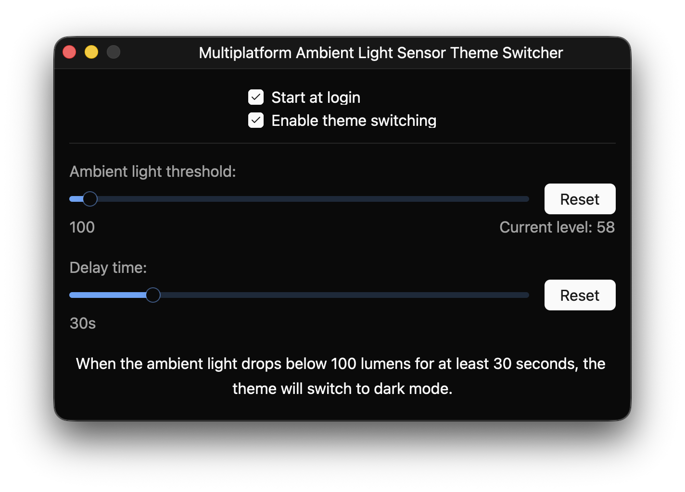
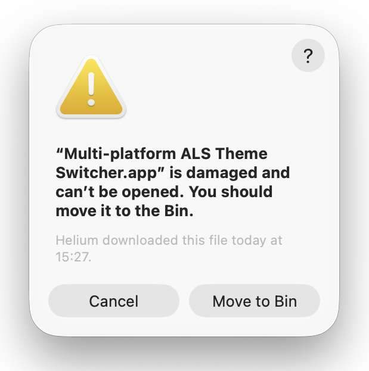

# Multiplatform Ambient Light Sensor Theme Switcher

[Builds: ](https://dl.circleci.com/status-badge/redirect/gh/STBoyden/mpalsts/tree/main)
[](https://codeberg.org/STBoyden/mpalsts/actions/workflows/clippy.yml)
[](https://codeberg.org/STBoyden/mpalsts/releases)

---

> [!NOTE]
> If you're viewing this on GitHub, please note that this is a mirror for CI/CD
> purposes only. Please make sure to refer all issues and pull requests to the
> [main repository on Codeberg](https://codeberg.org/STBoyden/mpalsts).



A multiplatform GUI application that switches your system's theme based on the
ambient light level around your laptop.

Currently supported platforms:

- MacOS
- Linux

Windows support is planned -- however I do not use Windows myself and do not
have plans to install it for the time being.

## Requirements

- A device with an ambient light sensor: Framework 13/16, MacBook Pro, etc.
- A device running on one of the above supported platforms.

## Installation

Nightly releases are availble on the releases page
[here](https://codeberg.org/STBoyden/mpalsts/releases).

### First-time run on MacOS

The app is not yet signed with a paid Apple developer ID, as such you will
probably get an error when you try and run the app for the first time, something
like this:



To fix this, open `Terminal.app` (⌘+Space > type "Terminal" > press Enter) and
run the following command:

```bash
# make sure to press enter after entering this
sudo xattr -d com.apple.quarantine "/Applications/Multi-platform ALS Theme Switcher.app"
```

You may need to enter your password when prompted in your terminal - which you
confirm with the enter key.

After you've followed these steps, you should be able to re-run the app without
the error showing up.

## Acknowledgements

The idea for this project came from wanting to port
[DarkModeBuddy](https://github.com/insidegui/DarkModeBuddy) to Linux. The sensor
code for MacOS is a port of DarkModeBuddy's Objective-C code to Rust. The
interface is also basically a straight rip, with some minor modifications.
